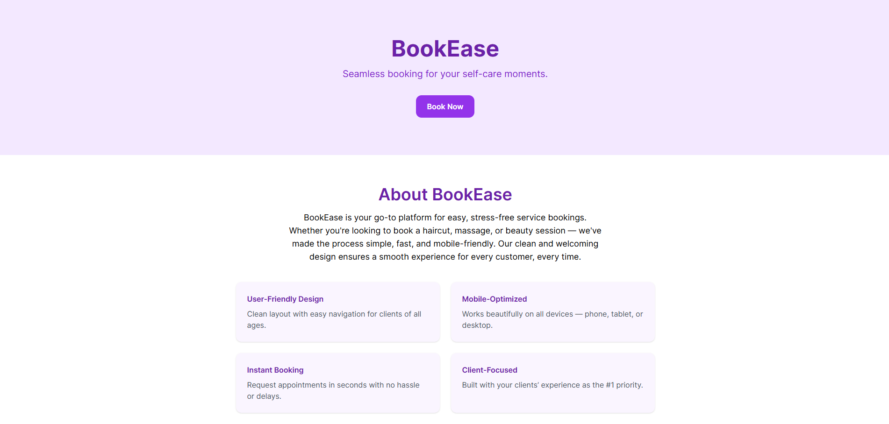
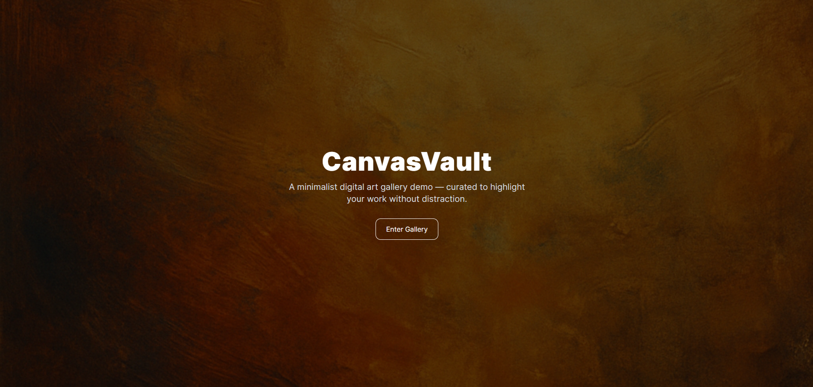
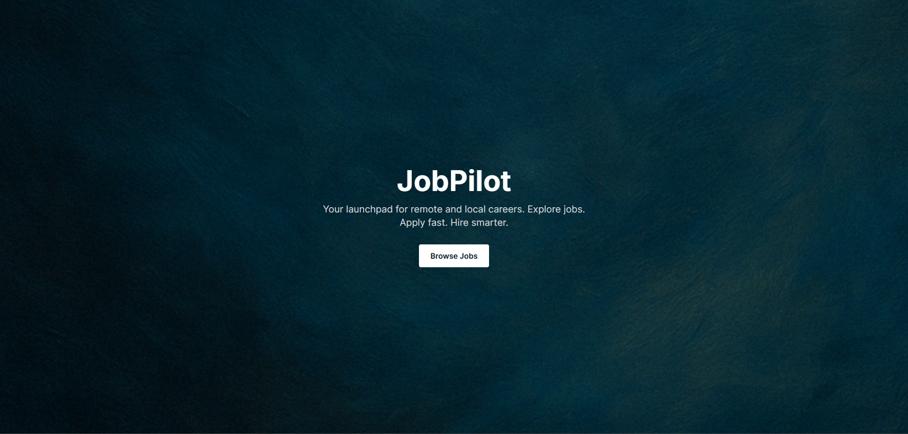

# TechSphere Portfolio

Welcome to the official portfolio of **Stefan de Bruin**, built under the TechSphere Technologies brand.  
This site serves as a demonstration of Stefan's frontend development skills, UI/UX strategy, and digital product design.

🌐 Live Site: [portfolio.techspheretechnologies.com](https://portfolio.techspheretechnologies.com)

---

## 🧩 Projects Featured

| Project        | Type               | Description |
|----------------|--------------------|-------------|
| BookEase       | Service Booking UI | Friendly, mobile-first appointment booking site. |
| Portfolio      | Freelancer Profile | Bold personal branding + service offerings. |
| BiteSize       | Digital Menu       | Interactive food menu with category filtering. |
| CanvasVault    | Online Art Gallery | Gallery-first layout with rich visual style. |
| EduPost        | Educational Blog   | Clean blog layout with contributors & posts. |
| JobPilot       | Job Board          | Startup-style job listings platform. |

---

## 🛠 Tech Stack

- ✅ HTML5
- ✅ Tailwind CSS (CDN)
- ✅ Vanilla JS (for interactions)
- 🎨 Responsive design for all devices

---

## 🔍 Live Previews

| Project | Preview |
|--------|---------|
| BookEase |  |
| CanvasVault |  |
| JobPilot |  |

### 📂 Direct Project Demos

- [BookEase](https://portfolio.techspheretechnologies.com/project-1-bookease/)
- [CanvasVault](https://portfolio.techspheretechnologies.com/project-4-canvasvault/)
- [JobPilot](https://portfolio.techspheretechnologies.com/project-6-jobpilot/)

## 🚀 License

This codebase is public for viewing and educational reference. Please do not clone or replicate commercial designs without permission.
